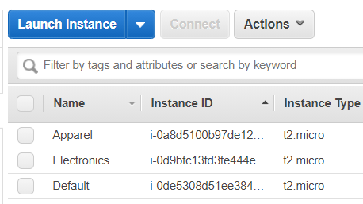
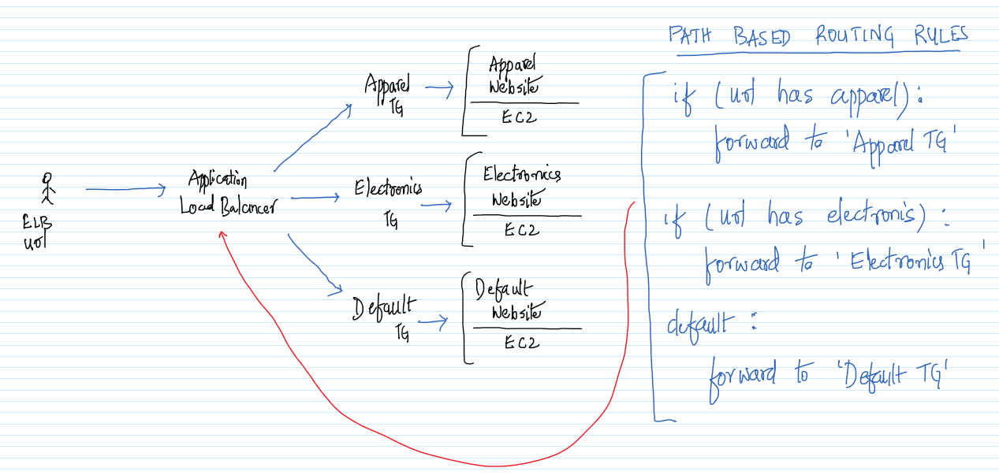
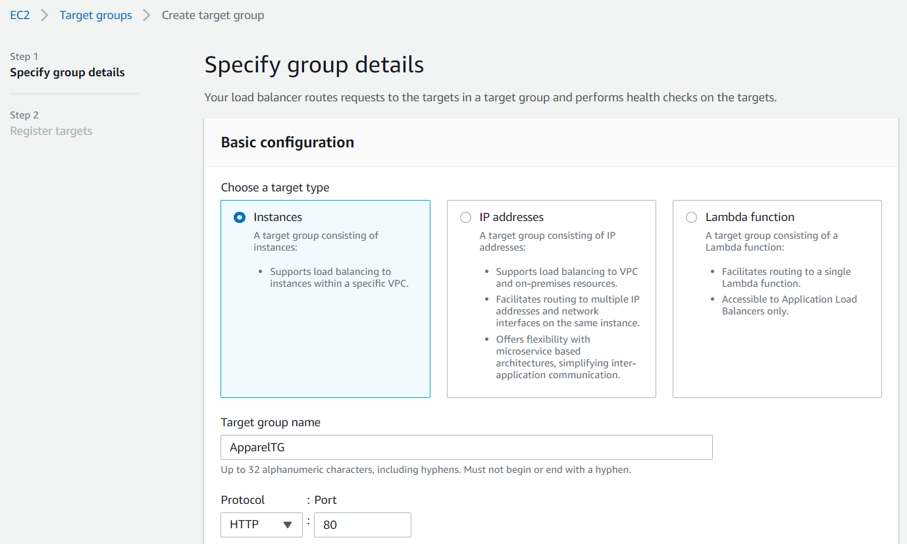
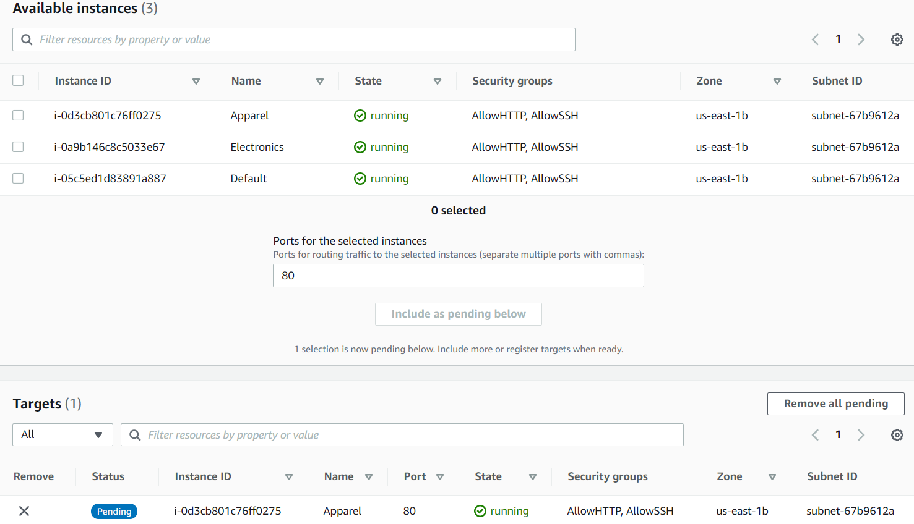
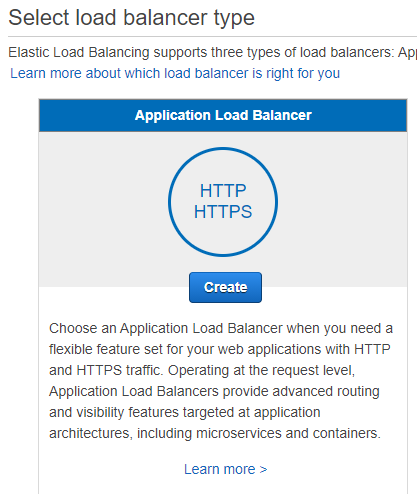
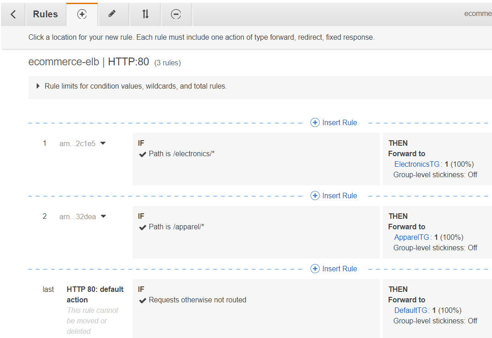
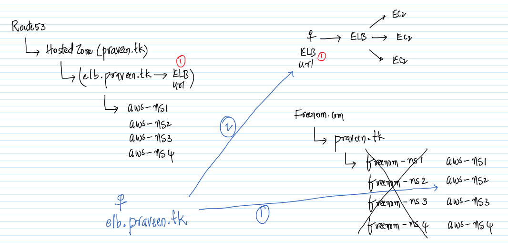
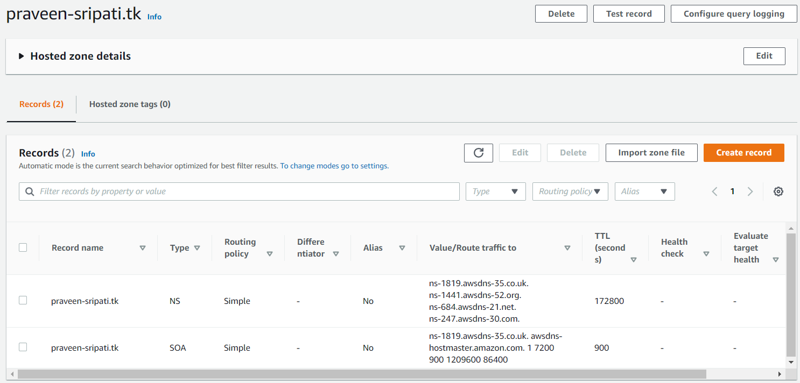
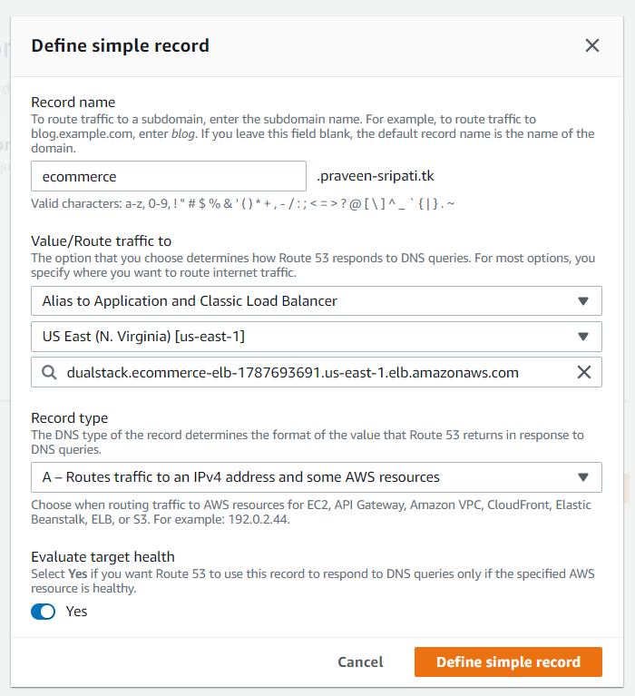
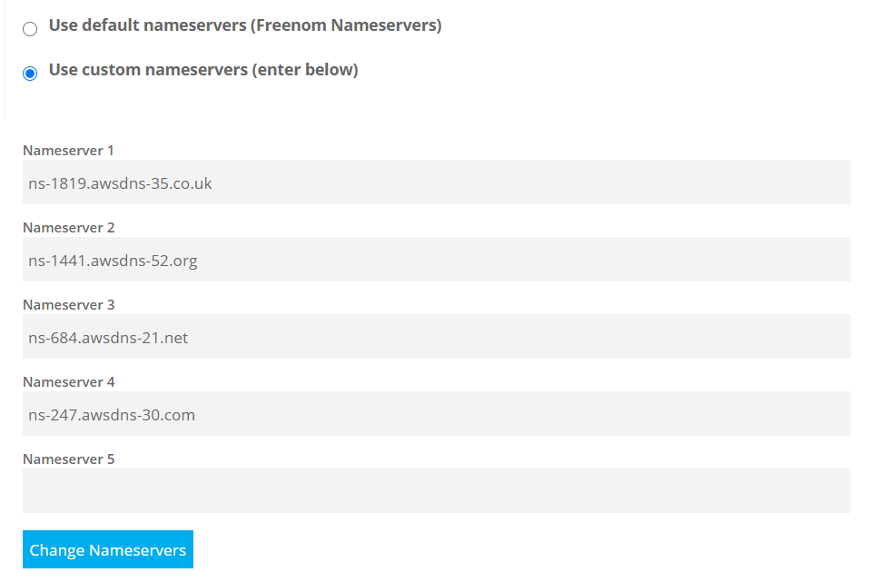

# Topics

    - Create an Application ELB and showcase the path based routing.
    - Register a domain with Freenom and use Route53 to provide a user friendly alternative to the ELB DNS name.

# Note

1. Depending on the Internet Service Provider and the Location, the changes to the Freenom and Route53 would take a few minutes to hours for the propagation to take place. If it doesn't work immediately, make sure that all the steps are completed properly and wait for a few hours.

1. Also, the entire lab can be performed for free within in the AWS Free Tier. The Route53 Hosted Zone is charged 50c/HZ/month unless deleted in 12 hours. So, make sure to delete it once done with the lab.

## Create EC2 Instances

1. Create three EC2 instances from the Launch Template and name them as Apparel, Electronics and Default.\

## Install the required softwares on them

1. Connect to all the EC2 instances via Putty and execute the below commands
    - sudo su
    - apt-get update
    - apt-get install apache2 -y
    - service apache2 start
    - cd /var/www/html
    - rm index.html

1. On the default EC2 instance execute the following command.
    -  echo "This is the default website" > index.html

1. On the apparel EC2 instance execute the following commands.
    - mkdir apparel
    - cd apparel
    - echo "This is an apparel website" > index.html

1. On the electronics EC2 instance execute the following commands.
    - mkdir electronics
    - cd electronics
    - echo "This is an electronics website" > index.html

1. Make sure that the web pages are accessible using the IP address via the browser.\

## Create an Application Load Balancer with **Path Based Routing**

1. In the EC2 Management Console, create three Target Groups with below names and default options. For each of the above Target Groups add the appropriate EC2 instance as the Target.
    - ApparelTG
    - ElectronicsTG
    - DefaultTG

1. Go back to the LoadBalancer Screen and create an Application Load Balancer.\

1. Give the Load Balancer a name and make sure to select all the Availability Zones. Click on Next.

1. It says `Your load balancer is not using any secure listener`. To avoid this we could have used SSL. For now we will go with non-HTTPS/non-SSL ELB. Click on Next.

1. Check `Select an existing security group` and select the `AllowAll` Security Group. Click on Next.

1. Select `Existing target group` and select the `DefaultTG`. The additional Target Groups can be selected later. Click on Next.

1. For the `Registered Targets`. Click on Next.

1. Review all the details and click on `Review`.

1. Note down the DNS name of the ELB.\

1. In the listeners tab, click on `View/edit rules`.\

1. Click on `plus button` to add a rule and click on `Insert Rule`.\

1. Create rules for the electronics and apparel website as shown below.\

1. Visit the pages as shown below and the appropriate web pages should be displayed. If this works then the path based routing works. Make sure to replace the ELB DNS name.\

## Register a domain in Freenom for free

1. Navigate to freenom.com.

1. Enter a domain name and check for the availability.

1. Click on `Get it now!` for a domain of your choice.

1. Click on `Checkout`.

1. Select `12 Months @ FREE` in the Period and click on `Continue`.

1. Enter your email and click on `Verify my Email address`.

1. A verification email will be sent. Click on the link in the email to confirm the email.

1. Enter `Your Details`, agree the T&C and click on `Complete Order` to register the domain.

1. In Freenom under `Services -> My Domains` the domain which has been registered earlier should appear as shown below.\

## Create a Route53 Hosted Zone with Records

1. In the Route53 Management Console, go to `Hosted zones` and click on `Created hosted zone`.

1. Enter the `Domain name` created in Freenom and click on `Create hosted zone`.\

1. A hosted zone would be created as shown below. Note down the four name servers.\

1. Click on `Create record`.

1. Select `Simple routing` and click on Next.

1. Click on `Define simple record`.

1. Define the record details as shown below. Click on `Define simple record`. Click on `Create records`.\

1. A record would be created as shown below in the hosted zone.\

## Update the DNS Records in Freenom for the registered domain

1. Navigate to the below URL and click on `Manage Domain`.
https://my.freenom.com/clientarea.php?action=domains

1. Click on `Management Tools -> Nameservers`.

1. Select `Use custom nameservers (enter below)`, enter the Name Servers got from the Hosted Zone one-by-one and click on `Change Nameservers`.\

## Test the user friendly name for ELB and test path based routing

1. As shown below not the ELB has a user friendly name.\  

# Further Reading

1. Listener rules for your Application Load Balancer
    - https://docs.aws.amazon.com/elasticloadbalancing/latest/application/listener-update-rules.html